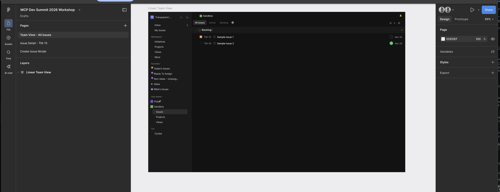
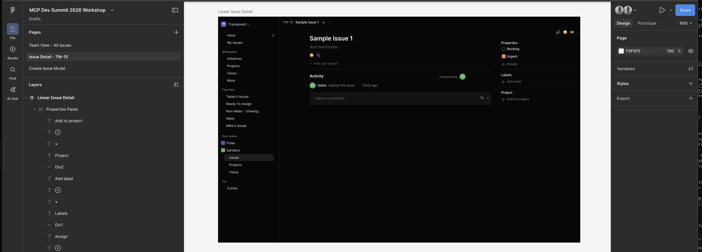
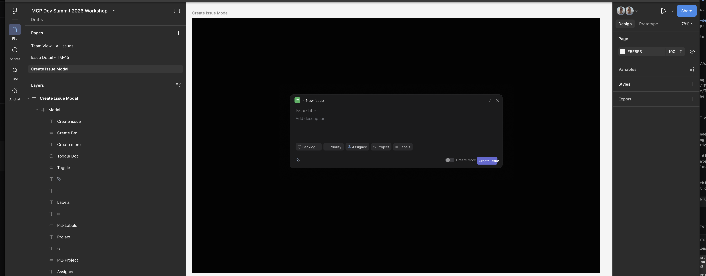

# Milestone 1: Idea to Figma Design

**Goal**: Take Linear's existing interface and produce a high-fidelity Figma design as our starting point.

## Context

We want to build a Linear clone for internal use. Linear is a great starting point from a UX perspective — we want to capture its interface as a foundation, then customize from there (colors, branding, layout opinions). The output of this milestone is a Figma design that a design team can iterate on.

## The Loop

The agent navigates Linear's UI with Chrome DevTools, captures the interface, and iterates with Figma to reproduce a high-fidelity design. The loop runs until the Figma design closely matches the source.

```
┌──────────────────────────────────────────────┐
│                                              │
│   Chrome DevTools (capture Linear UI)        │
│           │                                  │
│           ▼                                  │
│   Figma (create/update design)               │
│           │                                  │
│           ▼                                  │
│   Chrome DevTools (compare Figma ↔ Linear)   │
│           │                                  │
│       Match? ──── No ──→ loop back           │
│           │                                  │
│          Yes                                 │
│           │                                  │
│         Done                                 │
│                                              │
└──────────────────────────────────────────────┘
```

## MCP Servers

| Server | Role |
|--------|------|
| **Chrome DevTools** | Navigate and capture Linear's UI — the agent sees what a human would see |
| **Figma** | Create and iterate on the design until it matches the source |

## Closed Loop

- **Definition of done**: The Figma design is a high-fidelity reproduction of Linear's core interface
- **Verification**: The agent uses Chrome DevTools to visually compare the Figma output against the source UI — no human review needed to confirm fidelity
- **Human role**: None during the loop. You review the output after the loop completes.

## Starting Point

The `start/` directory is the starting point for this exercise — this is the first milestone, so no prior milestones are required.

## What You'll Have When Done

A high-fidelity Figma design of Linear's core UI — ready for your design team to customize.

## Guide

### Step 1: Set up your MCP servers

`cd` into the `start/` directory and verify your MCP servers are connected:

```
cd start
claude
## Inside Claude Code
/mcp
```

You should make sure **Chrome DevTools** is active and **Figma** is authenticated successfully before proceeding.

### Step 2: Create a Figma design file

Create a brand new, empty Figma design file where the agent will place its work. You can do this from the Figma dashboard — just create a blank file and copy its URL. You'll pass this URL to the agent later so it knows where to put the designs.

### Step 3: Connect Chrome for remote debugging

The Chrome DevTools MCP server needs to connect to a running Chrome instance. Set this up before starting the loop:

1. In Chrome, go to `chrome://inspect/#remote-debugging` and enable it
2. Navigate to [linear.app](https://linear.app) and log in — the agent will need access to the authenticated UI

Once Chrome is connected and you're logged into Linear, the agent can navigate and screenshot the UI through the Chrome DevTools MCP server.

### Step 4: Loop-closing prompt

```
I've created a Figma Design for you at https://www.figma.com/design/jNMRxmPldjEEwUqwcL9AU9/MCP-Dev-Summit-2026-Workshop?node-id=0-1&t=f4P3riCOykKD2hJG-1 and I've opened linear.app you can access with Chrome DevTools.

I want you to perfectly replicate the following Linear pages for me in Figma:
- https://linear.app/transparent-metrics/team/TM/all
- https://linear.app/transparent-metrics/issue/TM-15/sample-issue-1
- And the "create" modal I have open now in the Linear tab

Your Figma designs should be:
- Nearly pixel-perfect
- Use layers, like an expert designer would. I don't want just a screenshot in Figma. I want something I can adjust, drag, drop, etc on a per-element basis.

To accomplish this:
- Take screenshots and grab DOM elements to understand what you are recreating
- Take a pass at implementing it in Figma using a thoughtful, layer-driven process
- Then, take screenshots of what you have in Figma vs. what you have open in the browser
- Compare the screenshots
- Have a subagent critique how they are still different
- Make yourself a TODO list of fixes and iterate to get closer
- Do this at least 5 times; I want to be as close to pixel perfect (but still Figma-native) as possible
```

If you find yourself recreating prompts like this all the time, it's a good signal to consider turning it into a Skill. You'll find odds and ends worth adding too (e.g. gotcha's like "don't forget icons") to make your loop tighter than your first-ever pass at crafting a prompt.

This might take ~30 minutes to run on Opus 4.6 using Claude Code. When it's done, you have some decent design starting points. You can tweak to refine and polish in Figma, or otherwise just move into the next milestone.

Here's what ours looked like after the loop finished:

**Team View — All Issues**


**Issue Detail — TM-15**


**Create Issue Modal**


**Next up**: [Milestone 2 — Figma Design to Implementation →](../milestone-2/)
